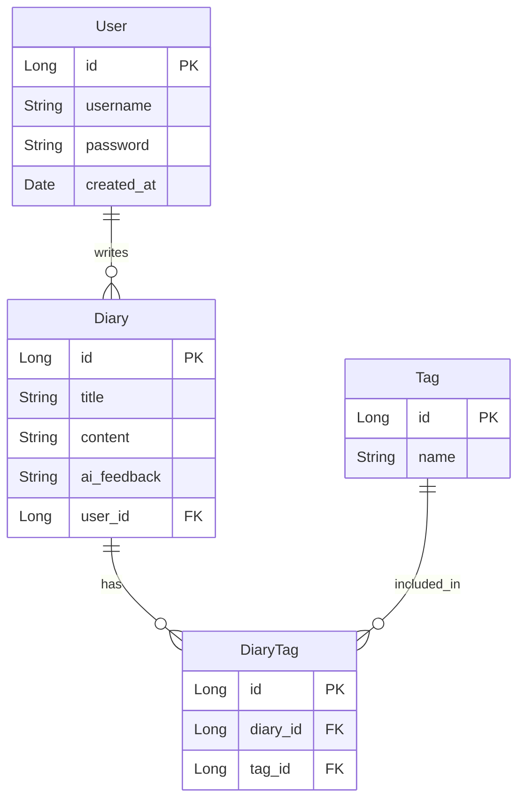

#  프로젝트 이름 (Project Name)
Ai 다이어리

## 개요 (Overview)
일기를 작성하는 행위는 심리적인 안정, 자기개발 등의 이점이 있습니다.  
하지만 대부분의 사람들은 일기를 매일 쓰는것에 있어 부담감, 귀찮음을 느끼곤 합니다.  

이 프로젝트는 사용자가 단순히히 일기를 작성하는 것에서 그치지 않고 ai api를 활용하여 즉각적인 피드백을 받아 일기의 이점을 극대화하는 일기장 개발을 목표로 합니다.  
사용자가 부담없이 쉽게 사용할 수 있도록 설계하고 있습니다.

최대한 RESTFUL하게!

## 주요 기능 (Key Features)
- **JWT 기반 사용자 인증**: Spring Security와 JWT를 활용하여 안전한 회원가입 및 로그인 기능을 제공합니다.
- **일기 CRUD**: 사용자는 일기를 생성하고 조회할 수 있습니다.
- **AI 피드백 연동**: Google Gemini API와 `WebClient`를 연동하여, 일기 생성 시 AI가 분석한 피드백을 자동으로 함께 저장합니다.

## 기술 스택
- Java 17
- Spring Boot 3.x
- Spring Web
- Spring Data JPA
- H2 Database
- Lombok

## 실행 방법

1.  **프로젝트 클론**
    ```bash
    git clone [이 저장소 주소]
    ```

2.  **보안 설정 파일 생성**
    `src/main/resources/` 경로에 `application-secret.yml` 파일을 생성하고, 아래 내용을 본인의 환경에 맞게 입력하세요.
    ```yaml
    jwt:
      secret: (시크릿 키 입력)

    spring:
      datasource:
        url: (DB URL 입력)
        username: (DB 계정)
        password: (DB 비밀번호)

    gemini:
      api:
        key: (Gemini API 키)
    ```

3.  **애플리케이션 실행**
    VSCode 또는 IntelliJ에서 `AiDiaryApplication.java` 파일을 열고 실행합니다.

## ERD


## 📑 API 문서 (Swagger)

본 프로젝트는 Swagger UI를 통해 API 명세를 자동으로 생성하고 테스트 환경을 제공합니다.

* **Swagger UI (로컬):** `http://localhost:3000/swagger-ui.html`

## 진행 상황 (Progress)
- [x] 사용자 회원가입 및 로그인 기능 구현 (JWT 기반)
- [x] 일기 생성(C) 및 조회(R) 기능 구현
- [x] Google Gemini API 연동을 통한 AI 피드백 자동 생성 기능 구현
- [x] 원격 서버(MariaDB)와 연동 및 배포 환경 구축
- [x] 민감 정보(DB, JWT, API Key)를 `application-secret.yml`로 분리하여 관리

## 향후 계획 (To-Do List)
- [ ] 전역 예외 처리 및 공통 응답 포맷 적용
- [ ] 일기 수정(U) 및 삭제(D) 기능 구현
- [ ] 일기 수정/삭제 시 작성자 본인만 가능하도록 인가(Authorization) 처리
- [ ] Refresh Token을 이용한 Access Token 재발급 로직 구현
- [ ] 사용자별 일기 조회 기능 구현 (`/api/my/diaries`)
- [ ] Swagger 또는 Spring REST Docs를 이용한 API 문서 자동화
- [ ] 단위 테스트(Unit Test) 및 통합 테스트(Integration Test) 코드 작성

## 참고 자료 (References)


## 메모장
<details>
<summary> <b> - 펼치기- </b> </summary>
- Nest에서는 TypeORM을 활용하여 관계형 데이터베이스를 객체 지향적인 방식으로 다뤘음. Spring에서는 Spring Data JPA가 해당 역할을 수행.  
- Spring Data JPA는 JPA라는 표준 기술을 쉽게 쓰게 함.
- JPA : JAVA의 ORM 인터페이스. DB랑 연동하기 위해 필요한 것들의 규칙을 정해놓은 것.
- DB 관련 정보는 application.properties에 작성
- 의존성 관련 등등은 build.gradle에 작성
- Dto는 Entity를 보조하는 역할을 수행하기에, Dto에서 직접 Entity로 변환하는 메서드를 가져야 한다.
- 빌더 개념 정리 1. Entity에서 @Builder 데코레이터를 사용한 생성자 작성, 2. dto의 toEntity()에서 .builder 사용.
- @ 어노테이션이라고 한다 함.
- ResponseEntity : 상태 코드, 헤더, 본문을 포함한 Spring에서 제공하는 클래스.
- Entity에서 CreatedDate, LastModifiedDate같은 어노테이션들은 다음과 같은 과정을 거쳐야 함.
    1. ~~Application.java에 @EnableJpaAuditing 어노테이션 추가
    2. 필요로 하는 엔티티 파일에서@EntityListeners(AuditingEntityListener.class) 어노테이션 추가
- @Service 와 @Component의 차이 : Component는 비즈니스 로직을 갖지 않고, 범용적인 목적으로 사용됨.
- jwt 밑 두가지 코드들의 역할
    1. JwtUtil : jwt라는 토큰이 진짜인지 가짜인지 판단, 발급 등
    2. JwtAuthenticationFilter : 모든 http 요청의 jwt를  검사하고, 그 결과를 바탕으로 다음 절차를 진행
        - 이때 Filter가 JwtUtil의 진위여부 판단 메서드를 활용함
- **jwt 관련 요청 내부 동작 순서**
    1. 요청이 들어오면 컨트롤러에 도달하기 전 SecurityConfig에 등록된JwtAuthenticationFilter가 요청을 가로챔
    2. 추출된 토큰을 JwtUtil을 활용하여 서명을 검증하고, 만료 시간을 확인. 이후 필터는 토큰에서 사용자 이름 추출
    3. UserDetailsServicelmpl에서 추출한 사용자 이름을 userRepository에서 DB에서 찾음.
        - 조회된 User엔티티 정보를 바탕으로 Spring Security가 이해할 수 있는 UserDetails객체를 생성하여 필터로 반환
    4. 필터는 UserDetails 객체를 받아 Authentication(UsernamePasswordAuthenticationToken) 객체를 생성함. 
        - 해당 객체 내에는 사용자 정보와 권한 정보가 포함되어 있음.
        - SecurityContextHolder.getContext()로 생성된 Authentication 객체를 SecurityContext에 등록
        - SecurityContext는 요청이 처리되는 동안 인증 정보를 보관함.
    5. filterChain.doFilter(request, response)가 호출되고, 다음 필터(혹은 컨트롤러)로 전달  
    6. **결론 : 이 모든 과정이 SecurityContext에 올바르게 사용자 정보와 권한 정보를 저장하기 위함이었음.**

- 토큰 관련 클래스 및 역할정리
    1. JwtUtil (jwt 패키지)
        -jwt의 생성, 서명, 만료시간설정, 유효성검증, 정보 추출 등 jwt와 관련된 모든 것
    2. UserDetailsServicelmpl (service 패키지)
        - Spring Security의 요청에 맞게, User 엔티티를 UserDetails 객체로 변환하여 제공
    3. JwtAuthenticationFilter (jwt 패키지)
        - 모든 http 요청을 가로채서, Authorization 헤더의 jwt를 검사
        - 그 결과를 바탕으로 Spring Security 시스템에 인증 정보를 등록함
    4. SecurityConfig (config 패키지)
        - 어플리케이션의 보안 규칙 설정.
        - 어떤 경로는 허용하고 어떤 경로를 막을지, 필터를 어떤 순서로 배치할지 등
- 토큰 발급 과정 : 클라이언트 -> 컨트롤러 -> 서비스 -> JwtUtil -> 컨트롤러 -> 클라이언트
- 토큰 검증 과정 : 클라이언트 -> 필터 -> JwtUtil -> UserDetailsServicelmpl -> 필터 -> 컨트롤러...
- Mono는 WebClient에서 사용하는 비동기 통신의 결과를 담는 클래스
- 같은 패키지 내부의 클래스들은 임포트 안해도 사용가능
- 자바는 클래스를 상속시켰을 경우, 자식클래스에 spuer()을 사용해야함. 다만 생략은 가능.
- 전역 예외 처리를 위해서는 RestControllerAdvice 어노테이션을 사용하는 컨트롤러가 필요
    1. CustomException(내가 작성), 이외에도 dto유효성관련, spring security관련, 이외에 모든 오류 관련 .class 가 필요.</details>
</details>


## 정리필요
- 리포지토리, 엔티티 개념 다시
- Config.java의 securityFilterChain 메서드 관련 개념 다시
- jwt 발급 및 인증과정 전부 다시

## 트러블슈팅
<details> <summary> <b> - 펼치기 - </b></summary>

1. 개발 환경 설정: Unresolved dependency와 NoSuchMethodError
   build.gradle에 mysql-connector-j나 springdoc-openapi 같은 새 라이브러리를 추가해도, VSCode가 관련 클래스를 찾지 못하는 cannot be resolved 오류가 발생했습니다. 또한 Swagger UI에 접속하면 GlobalExceptionHandler와 관련된 NoSuchMethodError가 뜨며 500 오류를 뱉었습니다.

원인은 크게 두 가지였습니다. 첫째는 의존성 추가 후 Gradle 프로젝트 동기화(새로고침)를 누락한 것이었고, 둘째는 Spring Boot 버전(3.3.2)과 springdoc-openapi 라이브러리(2.5.0) 간의 버전 호환성 문제였습니다.

문제를 해결하는 과정에서 Gradle 캐시 오염이 계속 발목을 잡았습니다. 결국 .gradle, build 폴더 및 사용자 홈 디렉토리의 전역 Gradle 캐시까지 완전히 삭제하고 의존성을 재설치하여 근본적으로 해결했습니다. 이 경험으로 IDE와 빌드 도구의 캐시가 개발에 미치는 영향을 직접 배웠습니다.

2. 원격 서버 연동: Communications link failure
   로컬의 Spring Boot 앱이 원격 동아리 서버의 MariaDB에 접속하지 못하고, 약 30초간 대기하다 Communications link failure 타임아웃 오류가 발생했습니다.

단순히 DB를 설치하고 계정을 만드는 것만으로는 외부에서 접속할 수 없다는 것을 깨달았습니다. 서버에는 **서버 자체의 방화벽(ufw)**과 상위 네트워크 방화벽이라는 2중 보안 계층이 있었습니다.

SSH로 서버에 접속해 ufw 설정을 열어 필요한 포트(SSH: 200, MariaDB: 3306)를 직접 허용했습니다. 이후 포트 포워딩 개념을 학습하고 서버 관리자에게 요청하여, 상위 네트워크단에서 외부 포트(210)와 내부 MariaDB 포트(3306)를 연결함으로써 문제를 최종 해결했습니다.

3. Spring Security와 JWT: 401/403 오류와 토큰 만료
   Spring Security 의존성을 추가하자마자, permitAll()로 설정한 로그인/회원가입 API조차 401/403 오류로 접근이 차단되었습니다. 또한, 발급된 JWT 토큰이 몇 초 만에 만료되거나 JWT signature does not match 오류가 발생했습니다.

원인을 파고드니, Spring Security는 기본적으로 CSRF 보호 기능이 활성화되어 GET 외의 요청을 차단한다는 것을 알게 되었습니다. 또한 jjwt 라이브러리가 요구하는 **비밀 키의 최소 길이(256비트/32바이트)**를 충족하지 못해 WeakKeyException이, 토큰 유효 시간을 '초(seconds)' 단위로 설정하고 로직에서는 '밀리초(milliseconds)'로 계산하는 불일치가 있었습니다.

SecurityConfig에서 **http.csrf().disable()**을 추가해 Stateless한 REST API 환경에 맞게 변경하고, 비밀 키를 32바이트 이상으로, 시간 단위를 * 1000L로 명확히 통일하여 모든 인증 문제를 해결했습니다.

4. JPA와 데이터 정합성: NullPointerException
   사용자별 일기 삭제 API를 호출할 때, diary.getUser().getId() 부분에서 NullPointerException이 발생했습니다.

원인은 간단했습니다. 사용자(User) 기능이 추가되기 이전에 생성했던 테스트용 일기 데이터들은 user_id 컬럼이 NULL 상태였기 때문입니다.

DELETE FROM diary WHERE user_id IS NULL; 쿼리로 오래된 테스트 데이터를 정리하여 데이터 정합성을 맞췄습니다. 이 과정을 통해 개발 중 스키마 변경이 기존 데이터에 미치는 영향을 이해하고, 데이터 마이그레이션의 필요성을 간접적으로 경험했습니다.

</details>

### 작성중...